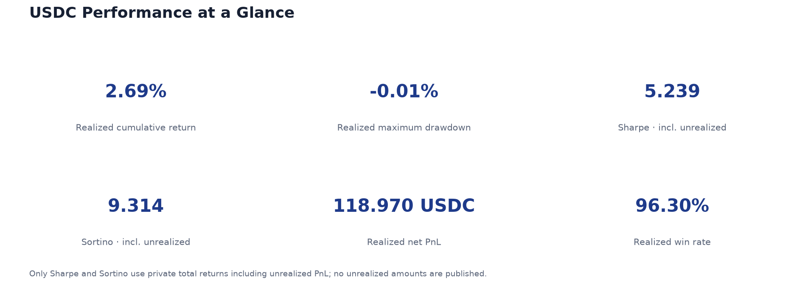
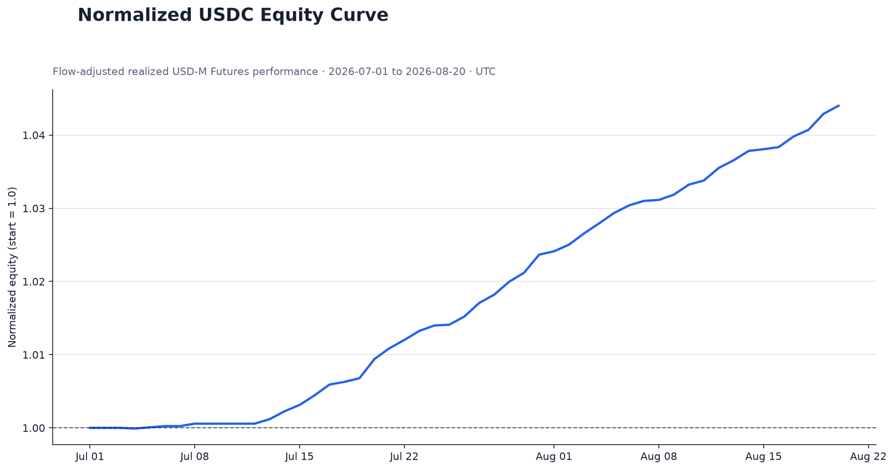
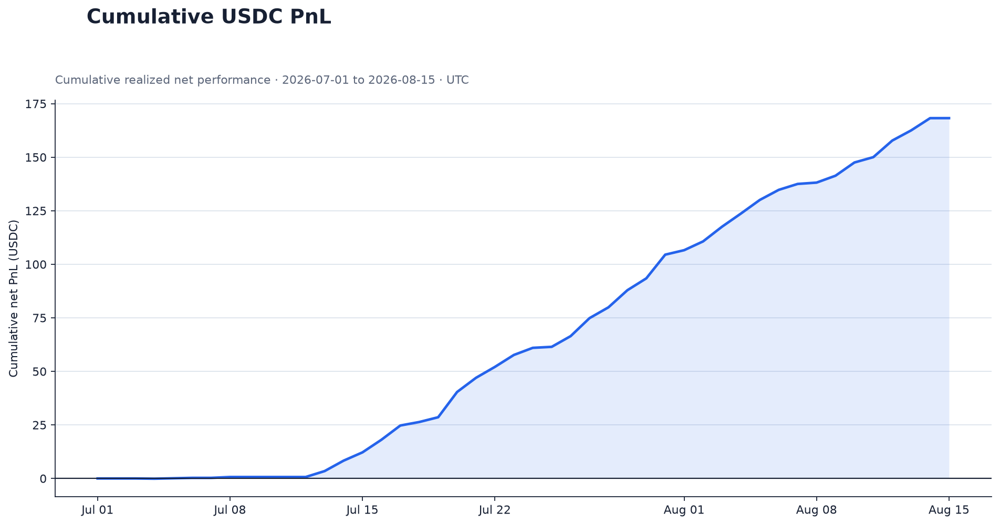
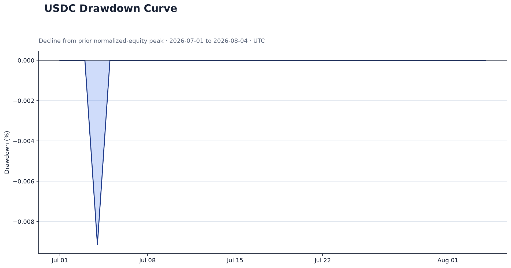

# Portfolio Track Record

A privacy-preserving, locally generated view of live `USDC` USD-M Futures performance from **2026-07-01 00:00 UTC**. This repository is designed for interview and professional evaluation.

The reporting pipeline runs on the owner's machine using the project-specific Python environment. It reads Binance through signed, read-only endpoints, generates daily PnL and risk reports, and pushes only sanitized output files to GitHub. No fabricated PnL data is committed.

## Latest performance









Additional outputs:

- [Daily returns](reports/daily_returns.png)
- [Monthly returns](reports/monthly_returns.png)
- [Performance summary](reports/performance_summary.md)
- [Normalized daily data](data/processed/normalized_daily_equity.csv)

## Security model

- Credentials exist only in the local `.env` file, which is ignored by Git and must have file mode `600`.
- The update script accepts only `BINANCE_API_KEY`, `BINANCE_API_SECRET`, and optional `GITHUB_TOKEN`; unknown, duplicate, empty, or missing required entries stop execution.
- The client exposes only USD-M Futures account and income-history `GET` requests.
- There is no order, cancellation, deposit, withdrawal, or transfer operation in the code.
- The program never logs credentials, signatures, query strings, or authentication headers.
- Absolute account equity and account identifiers are never published. The equity curve starts at `1.0`.
- Daily unrealized PnL, positions, and total-equity history remain in ignored local-only files. Only the aggregate Sharpe and Sortino ratios calculated from total returns are published.
- Automatic Git commits include only `reports/` and `data/processed/`.

Use a dedicated Binance key with read permission only. Do **not** enable Spot trading, Futures trading, withdrawals, or transfers.

The local credential file must contain exactly:

```dotenv
BINANCE_API_KEY=your_api_key_here
BINANCE_API_SECRET=your_api_secret_here
GITHUB_TOKEN=your_github_token_here
```

Apply private permissions:

```bash
chmod 600 .env
```

`GITHUB_TOKEN` is required only for automatic publishing. Prefer a fine-grained token restricted to this repository with **Contents: Read and write**. The token is passed to Git through a local askpass process and is never stored in the remote URL.

## Performance scope

Only income rows whose asset is exactly `USDC` are included. Every observation is assigned to a UTC calendar day.

| Component | Treatment |
|---|---|
| `REALIZED_PNL` | Included in daily PnL |
| `COMMISSION` | Included in daily PnL, normally negative |
| `FUNDING_FEE` | Included in daily PnL with its Binance sign |
| `TRANSFER` | Used in memory to adjust the return capital base; excluded from PnL and never published as a transfer record |
| Other income types | Conservatively treated as capital adjustments and disclosed as a non-sensitive warning |
| Unrealized PnL | Kept local; included only in the published aggregate Sharpe and Sortino ratios |

The public CSV contains daily returns, normalized equity, drawdown, daily realized PnL, commission, funding, net PnL, and trade count. It never contains the account balance, API metadata, UID, email, wallet address, or transaction hash.

Private detailed outputs are written to `local_reports/`, and the underlying official USDC equity snapshots, account-trade cache, and one-minute mark-price cache are retained in `data/private/`. Both directories are ignored by Git. Minute results are compressed into UTC-day partitions under `local_reports/minute/`. The local report includes a minute-level total equity curve, minute-level realized/unrealized/combined PnL, and daily/monthly returns including unrealized PnL. Minute unrealized PnL is reconstructed from trades and mark prices and calibrated to official account snapshots.

Private raw data is stored in compressed UTC-day partitions under `data/private/{income,trades,mark_prices,snapshots}/`; a valid empty partition records a queried day with no events. The private `state.json` records the last successful fetch cursor for each stream and symbol. Each update requests only the missing interval plus a small safety overlap: 10 minutes for mark prices, one day for income and trades, and two days for account snapshots. Overlapping records are merged by their Binance identifiers or timestamps, so they are refreshed rather than duplicated. This preserves local history after it ages out of Binance's API window.

## Local environment and updates

Create the isolated environment once:

```bash
python3.12 -m venv .venv
source .venv/bin/activate
python -m pip install -r requirements.txt
```

Generate and validate reports without committing or pushing:

```bash
.venv/bin/python -B -m src.local_update --no-push
```

Generate reports, commit only sanitized outputs, and push them to `origin/main`:

```bash
.venv/bin/python -B -m src.local_update
```

The publisher requires the `main` branch, refuses to run when the Git index already has staged changes, fast-forwards from `origin/main`, validates every required output, and does not create an empty commit.

## Local schedule

This machine has a local schedule for **08:10 Asia/Shanghai**. A temporary enable flag is cleared by every reboot, so updates do not resume until they are manually enabled again.

```bash
./scripts/scheduler.sh start
```

There is no continuously running daemon. The log file, enable flag, and process-lock file are local-only. The non-blocking lock prevents overlapping updates. See [Local Operations](docs/OPERATIONS.md) for the short start, status, stop, and log commands.

## Daily metric definitions

Crypto markets trade continuously, so annualization uses `365` days.

| Metric | Definition |
|---|---|
| Daily net PnL | Daily USDC realized PnL + commission + funding fee |
| Daily return | Daily net PnL divided by reconstructed starting USDC capital; positive same-day transfers are conservatively added to the denominator |
| Normalized equity | Cumulative product of `(1 + daily return)`, starting at `1.0` |
| Cumulative return | Final normalized equity minus `1.0` |
| Annualized return | Geometric cumulative return raised to `365 / valid daily observations`, minus one |
| Annualized volatility | Sample standard deviation of daily returns multiplied by `sqrt(365)` |
| Sharpe ratio | Mean daily return divided by sample daily volatility, multiplied by `sqrt(365)`; risk-free rate is zero |
| Sortino ratio | Mean daily return divided by sample downside deviation, multiplied by `sqrt(365)`; target return is zero |
| Maximum drawdown | Largest percentage decline from a prior normalized-equity peak |
| Calmar ratio | Annualized return divided by the absolute maximum drawdown |
| Win rate | Positive net-PnL days divided by non-zero net-PnL days |
| Profit factor | Sum of positive daily net PnL divided by the absolute sum of negative daily net PnL |

Zero denominators, insufficient samples, missing rows, and invalid reconstructed capital bases return `null` or are explicitly excluded; they never become infinity or a made-up value.

## API retention and historical continuity

Binance's standard USD-M Futures income endpoint currently exposes only the latest three months. The local updater requests data in seven-day windows and paginates every window. While July 2026 remains available, the first successful run establishes the full inception history. Later runs preserve verified daily rows that have aged out of the API window, overwrite overlapping days with fresh Binance results, and recompute the complete normalized curve and risk metrics.

## Limitations

- The track record begins on 2026-07-01 and covers USDC USD-M Futures only.
- Daily flow timing is approximated because only event timestamps and daily aggregation are available. Positive same-day transfers are added to the denominator to avoid overstating returns.
- Public curves and daily files are realized-return based. Unrealized PnL is retained locally and affects only the published aggregate Sharpe and Sortino ratios.
- If the account uses multi-asset collateral, the USDC asset row may not capture economic exposure caused by price changes in other collateral assets.
- The local machine must remain powered on, connected to the network, and able to access Binance and GitHub at the scheduled time. Cron will run a missed update only at the next scheduled occurrence.

This repository is for interviews and professional evaluation only. It is not investment advice, a solicitation, or a guarantee of future performance.
